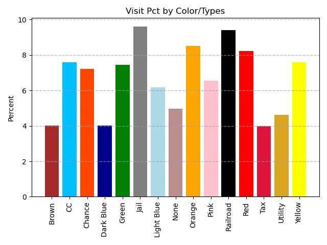
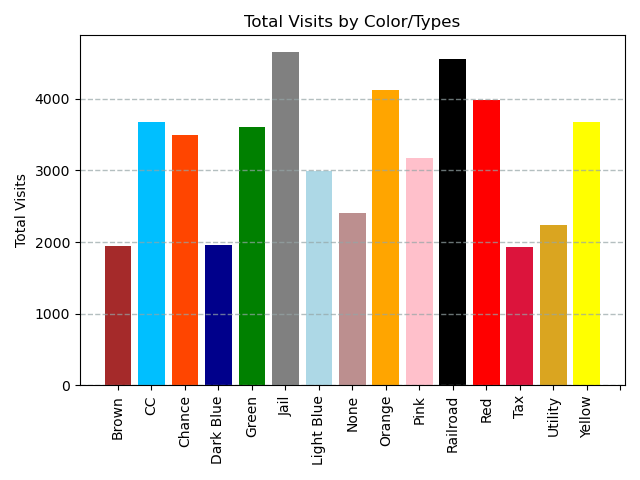

# Monopoly Simulation
Performed 100-game 100-turn simulation of popular board game Monopoly to find most frequented properties.

## Results

## Future Features
- Players Buy Properties
  - Enforce rent, houses, and hotel payments

- Add Auction functionality for properties passed by players

- Track winners and losers of each game
